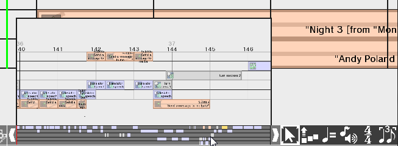
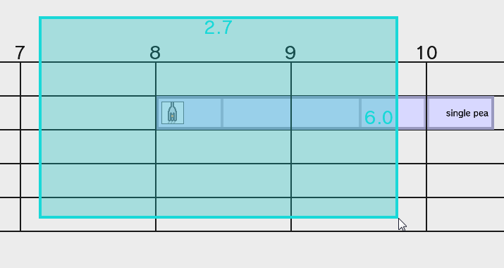
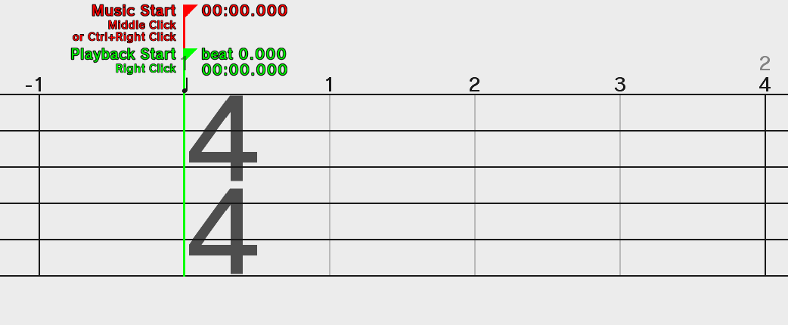
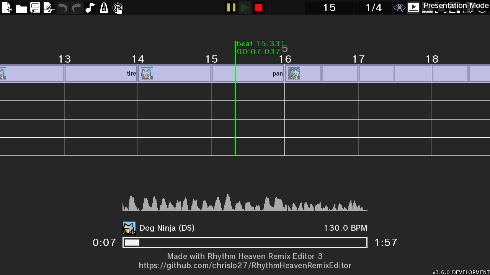

# Readme

This readme is up to date with version `v3.11.0`.

Please read through the sections of this readme. There are MANY
other features and other intricacies that are not mentioned,
but do contain info inside the program.

You will learn best through experimentation; don't give up!

## Launching the program
After decompressing/unzipping the zip archive, run the
`run_windows.bat` file by double clicking if you're on Windows, or
run the `run_macOS-linux.sh` file if you're on macOS or a UNIX operating
system.

Alternatively, open Command Prompt/Terminal inside
the folder *containing the jar file* and run
`java -jar RHRE3.jar`.

## How does a remix work?
Remixes in RHRE3 have changed since RHRE2.

They are now no longer dictated by the last cue, but instead go on forever
until you place an **End Remix** entity.
You can find this at `Misc. > Special Entities > End Remix`.

If you are familiar with music theory, this also is used in sheet music
to end the music piece.
You can only have **one** of these in the track at any given time. 
If you liked the old RHRE2 way of ending remixes, there's an option in the
Info Screen.

Cues and patterns are examples of *entities*. RHRE3 adds three new entities:
random cue, equidistant, and keep the beat.

**Random cues** will randomly play a cue or pattern each time you play the remix.
This is useful for games like First Contact, or Ringside.

**Equidistant** entities are for patterns like Built to Scale (DS) or
Bouncy Road. By *stretching* the entity, you will change the time *between*
cues. If you want your "do-re-mi-fa-so" (Built to Scale DS) to have 2 beats
in between, just extend this entity to 2 beats long. The editor will take
care of adding the other cues for you!

**Keep the beat** entities are for games like Lockstep, Flockstep, or any other
game that has a consistent pattern. By *stretching* this entity, you can
make constant beats without laying down multiple patterns.

## Starting a new remix
The parameters you need to set when starting a new remix (such as the
tempo) are covered [in this document](Starting-a-remix.md). You should,
however, read up on the controls first below!

## Controls
### Generic keystrokes
**`SPACEBAR`** - Play/stop remix 
**`SHIFT+SPACEBAR`** - Pause/resume remix 
**`CTRL+N`** - New remix 
**`CTRL+O`** - Open remix 
**`CTRL+S`** - Save remix 
**`CTRL+Z`** - Undo 
**`CTRL+SHIFT+Z`** or **`CTRL+Y`** - Redo 
**`HOME`** - Jump to beat 0 
**`END`** - Jump to last entity/End Remix entity 
**`UP`** or **`W`** - Scroll up (only in editor) 
**`DOWN`** or **`S`** - Scroll down (only in editor) 
**`SHIFT+SCROLL`** - Pan camera (hold **`CTRL`** to increase speed) 
**`TAB`** - Cycle through scroll modes 

On the top bar, you will see various buttons. Hover over them to view
what they're used for.
 For detailed info, [**see this page**](Toolbar.md).

On the bottom half of the screen, you will see icons for each
game on the left, and patterns and cues for the selected
game on the right. Using the Selection tool, you can drag
from the pattern area up to the track to place down patterns.
**`SCROLL`** or click on the arrows to cycle through your options.
You can click on the speaker button on the right to preview the pattern.

In the bottom-right, you will see tools:

From first to last: **Selection**, **Multipart Split**, **Tempo Change**,
**Music Volume**, **Time Signature**, and **Swing**. They will be explained below.
You can access them quickly by pressing `1-6` on the number keys.

To the left of the tool buttons you'll see a minimap.
**`LEFT CLICK`** will jump the camera to that position.
Hover over the minimap to bring up a preview.
Click the buttons on the sides of the minimap to pan the camera.
Right clicking these buttons will jump to the start and end of the remix respectively.
You can also go to the Info and Settings menu to disable the minimap and/or the preview.

>If the preview doesn't appear, check the Info and Settings menu.
The preview may have disabled itself if your graphics driver is not able
to support it. 

### Selection tool
The selection tool will be your main tool. It allows you to
drag up cues and patterns from the pattern selector and create
selections on the track.

Holding **`LEFT CLICK`** (not on a selected entity) will start a selection. 
You can hold **`SHIFT`** to make it additive (i.e.: you can add to a
pre-existing selection). Starting in `v3.1.0`, holding **`CONTROL`** will
make it an inverted/XOR selection. 
**`RIGHT CLICK`** will cancel the selection.

After you have made your selection, you can hold **`LEFT CLICK`** and
drag. You can drag it around anywhere as long as it's still fully in the track,
and doesn't collide with any other entities.

If you hold **`ALT`** while starting a drag, you will copy the selection.

If you hold **`CONTROL+ALT`** (**`SHIFT+ALT`** on macOS) while starting a drag, you will make what's called
a *response-copy*. For games like First Contact or Working Dough, making a
response-copy of the "leader" cues will make a special copy of the player
cues! This is one example of new functionality added to RHRE3.

Pressing **`BACKSPACE`** or **`DELETE`** with a selection made will delete it.

#### Scroll Mode
 
**`SCROLL`** or **`UP`**/**`DOWN`** will do the following based on the
**scroll mode** (changeable with the button on the toolbar or by pressing **`TAB`**):
* Change the pitch of any **selected** cues by a semitone, if possible
  * Holding **`CTRL`** will change it in increments of two
* Change the volume of any **selected** cues in increments of 5%
  * Holding **`CTRL`** will change it in increments of 25%

#### Playback Start
The Playback Start (default green) tracker will be the starting point of the
remix each time you play it. This is controlled through **`RIGHT CLICK`**.
Keep setting this as you build your remix so you can quickly listen to it.

#### Music Start
The Music Start (default red) tracker is the starting point of the music.
This is controlled through **`MIDDLE CLICK`** or **`CTRL+RIGHT CLICK`**.
If you notice that everything is slightly offbeat, or the music has a period of silence,
consider moving this tracker backwards so the actual music will start on time.

If you hold **`SHIFT`** after starting to move the music start tracker,
you will unlock snapping and be free to move it as precisely as needed.

>Note: As of `v3.7.0`, the Music Start tracker only shows the seconds.
For each beat on the track, the Music Start tracker will be at that
value in **seconds**. (Example: putting it where beat 1 is actually puts
it at second 1.) This change was made to make it more intuitive to use.

## Multipart Split tool
The multipart split tool is very simple: **`LEFT`** clicking on a *multipart entity*
(that is, an entity made up of multiple entities like patterns, random cues,
equidistants, and keep-the-beats) will split it into whatever it was made of.

Use this when you need to fine-tune a pattern's components.

## Tempo Change, Music Volume, Time Signature tools
These tools are very similar. They control what are called *trackers*.

>Note: wherever you see `SCROLL`, you can substitute this with **`UP`**
or **`DOWN`**. This is useful if you don't have access to a mouse, like
on a laptop.

All tracker-like tools share these controls: 
**`LEFT CLICK`** - Place tracker 
**`RIGHT CLICK`** - Remove tracker 
**`SCROLL`** - Change value 
Hold **`CONTROL`** - Change value by 5x

 
The **tempo change** tool has changed slightly from RHRE2. You can change the tempo
mid-remix. You can hold **`SHIFT`** to change it in increments of 0.1 BPM.
Holding **`CONTROL`** while holding `SHIFT` will change it in increments of
0.5 BPM.

 
The **music volume** tool is new in RHRE3. You can change the music volume
mid-remix as a percentage from 0-200%. Starting in v3.6.0, clicking and
dragging the ends will allow you to make smooth transitions
for a perfect fade-out.

 
The **time signature** tool is new in RHRE3. You can change the time signature
mid-remix as a value over 4 (that is, everything is in X/4 time). If you
are fluent with music theory, you will use this tool to your advantage
to create measures so your patterns don't sound "off". You can only place this
on whole, non-negative beats.

## Swing tool
The Swing tool is covered [in its own article here.](Swing-tool.md)

# Stored Patterns
By clicking on the Stored Patterns tab (the chest icon), you can
drag down selections and store them for later.

# Tapalong
The tapalong menu is recurring from RHRE2, this time it is inline with the
editor. The main purpose of tapalong is to be able to tap to the rhythm of
a song to determine its BPM.

# Views
Views are useful ways of viewing your remix. You can mix and match views too.

## Game Boundaries
This highlights all the game boundaries and where they transition at.
This also works in presentation mode. A game is said to transition when
a new cue/pattern from a different game is introduced.

## Waveform
This shows the live audio data as the remix plays.
This also works in presentation mode.

## Glee Club (midis only)
This shows the tracks of a loaded midi file as Glee Club singers.
Their heights represent the note they are playing.

