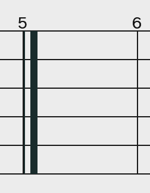

# Readme

This readme is up to date with version `v3.1.1`.

## How does a remix work?
Remixes in RHRE3 have changed since RHRE2.

They are now no longer dictated by the last cue, but instead go on forever
until you place an **End Remix** entity.
You can find this at `Misc. > Special Entities > End Remix`.

If you are familiar with music theory, this also is used in sheet music
to end the music piece.
You can only have **one** of these in the track at any given time. 
If you liked the old RHRE2 way of ending remixes, there's an option in the
Info Screen.

Cues and patterns are examples of *entities*. RHRE3 adds three new entities:
random cue, equidistant, and keep the beat.

**Random cues** will randomly play a cue or pattern each time you play the remix.
This is useful for games like First Contact, or Ringside.

**Equidistant** entities are for patterns like Built to Scale (DS) or
Bouncy Road. By *stretching* the entity, you will change the time *between*
cues. If you want your "do-re-mi-fa-so" (Built to Scale DS) to have 2 beats
in between, just extend this entity to 2 beats long. The editor will take
care of adding the other cues for you!

**Keep the beat** entities are for games like Lockstep, Flockstep, or any other
game that has a consistent pattern. By *stretching* this entity, you can
make constant beats without laying down multiple patterns.

## Controls
If you are familiar with RHRE2's controls, you should have no problem
with RHRE3.

### Generic keybinds
**`SPACEBAR`** - Play/stop remix 
**`SHIFT+SPACEBAR`** - Pause/resume remix 
**`CTRL+N`** - New remix 
**`CTRL+O`** - Open remix 
**`CTRL+S`** - Save remix 
**`CTRL+Z`** - Undo 
**`CTRL+SHIFT+Z`** or **`CTRL+Y`** - Redo 
**`HOME`** - Jump to beat 0 
**`END`** - Jump to last entity/End Remix entity 
**`PGUP`** or **`UP`** or **`W`** - Scroll up (only in editor) 
**`PGDOWN`** or **`DOWN`** or **`S`** - Scroll down (only in editor) 

On the top bar, you will see various buttons. Hover over them to view
what they're used for.

In the bottom-right, you will see tools:

From first to fifth: **Selection**, **Multipart Split**, **Tempo Change**,
**Music Volume**, and **Time Signature**. They will be explained below.
You can access them quickly by pressing `1-5` on the number keys.

### Selection tool
The selection tool will be your main tool.

Holding **`LEFT CLICK`** (not on a selected entity) will start a selection. 
You can hold **`SHIFT`** to make it additive (i.e.: you can add to a
pre-existing selection). Starting in `v3.1.0`, holding **`CONTROL`** will
make it a toggle - similar to a file explorer (this also disables dragging,
so you can actually click on already-selected entities).
**`RIGHT CLICK`** will cancel the selection.

After you have made your selection, you can hold **`LEFT CLICK`** and
drag. You can drag it around anywhere as long as it's still fully in the track,
and doesn't collide with any other entities.

If you hold **`ALT`** while starting a drag, you will copy the selection.

If you hold **`CONTROL+ALT`** while starting a drag, you will make what's called
a *response-copy*. For games like First Contact, or Working Dough, making a
response-copy of the "leader" cues will make a special copy of the player
cues! This is one example of new functionality added to RHRE3.

Pressing **`BACKSPACE`** or **`DELETE`** with a selection will delete it.

## Multipart Split tool
The multipart split tool is very simple: **`LEFT`** clicking on a *multipart entity*
(that is, an entity made up of multiple entities like patterns, random cues,
equidistants, and keep-the-beats) will split it into whatever it was made of.

Use this when you need to fine-tune a pattern's components.

## Tempo Change, Music Volume, Time Signature tools
These three tools are very similar. They control what are called *trackers*.

>Note: wherever you see `SCROLL`, you can substitute this with **`PAGE UP`**
or **`PAGE DOWN`**. This is useful if you don't have access to a mouse, like
on a laptop.

All tracker-type tools share these controls:

**`SCROLL`** - Change value 
Hold **`CONTROL`** - Change value by 5x

The **tempo change** tool is exactly the same as in RHRE2. You can change the tempo
mid-remix. You can hold **`SHIFT`** to change it in increments of 0.1 BPM.
Holding **`CONTROL`** while holding `SHIFT` will change it in increments of
0.5 BPM.

The **music volume** tool is new in RHRE3. You can change the music volume
mid-remix as a percentage from 0-100%.

The **time signature** tool is new in RHRE3. You can change the time signature
mid-remix as a value over 4 (that is, everything is in X/4 time). If you
are fluent with music theory, you will use this tool to your advantage
to create measures so your patterns sound correct.

